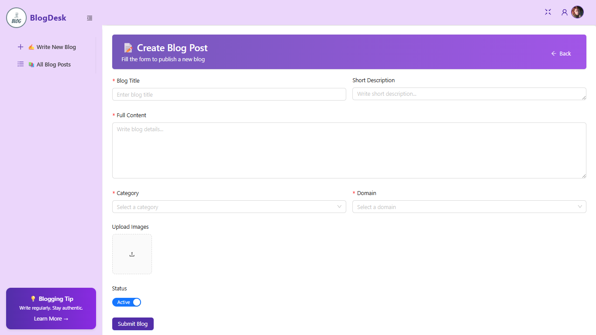
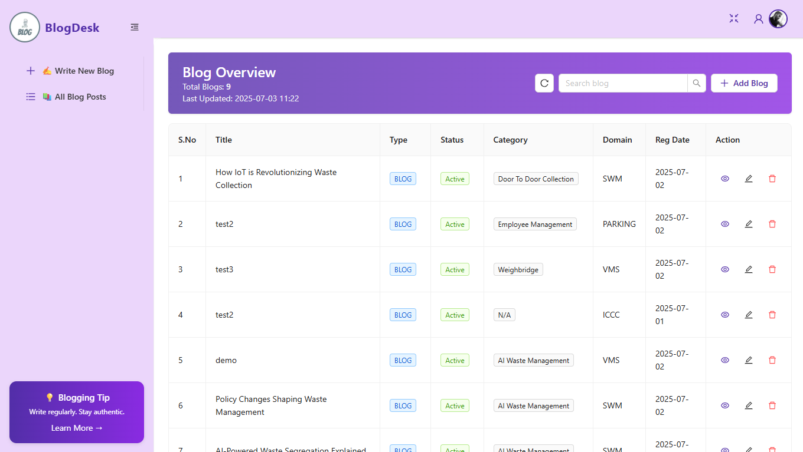

# 📝 Blog Post UI

A modern and responsive **blog management interface** built with **React**, **Ant Design**, and **Axios**. Easily create, edit, and manage blog posts with support for rich content, image uploads, pagination, and search.

---

## 🚀 Features

- ➕ Create and edit blog posts with form validation  
- 🖼️ Upload multiple images using Ant Design `Upload`  
- 📄 View blog post details in a modal  
- 🔍 Search and filter blog entries  
- 📋 Paginated blog listing table  
- 🎞️ Smooth animations with GSAP *(optional)*  


---

## 🖼️ Screenshots

### 🔹 Blog Form Page  


### 🔹 Blog List View  


---

## 🛠️ Tech Stack

| Technology       | Description                |
|------------------|----------------------------|
| ⚛️ React         | Frontend library            |
| 🎨 Ant Design    | UI components & layout      |
| 🌐 Axios         | API handling                |
| 🧭 React Router  | Client-side routing         |
| ✨ GSAP          | Optional animation library  |
| ⚡ Vite           | Build tool for fast dev     |

---

## ⚙️ Getting Started

Follow these steps to set up the project locally:

```bash
# 1. Clone the repository
git clone https://github.com/raunak9081/Blog-post.git
cd Blog-post

# 2. Install dependencies
npm install

# 3. Run the app
npm run dev

# 4. Build for production
npm run build

👨‍💻 Author
Made with ❤️ by Raunak Singh

